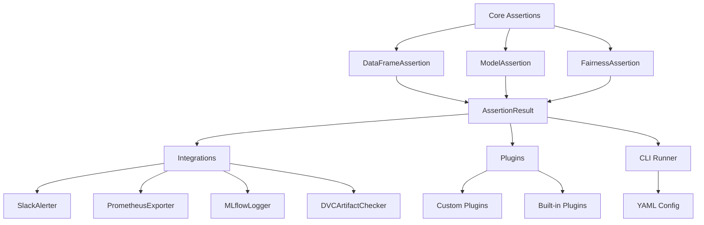

# ml-assert

A lightweight, chainable assertion toolkit for validating data and models in ML workflows.

## Features

- **Data Validation**: Schema, nulls, uniqueness, ranges, and value sets.
- **Statistical Checks**: Distribution drift (KS, Chi-square) and drift detection.
- **Model Performance**: Accuracy, precision, recall, F1-score, and ROC AUC.
- **Fairness & Explainability**: Demographic parity, equal opportunity, and SHAP values.
- **Integrations**: MLflow, Prometheus, Slack, and DVC.
- **Fluent Interface**: Chain assertions for clean, readable code.
- **CLI Runner**: Run checks from a YAML configuration.

---

## Architecture Overview



---

## Documentation Structure

- **User Guide**: High-level documentation with examples and use cases
  - [Data Assertions](data_assertions.md)
  - [Statistical Assertions](statistical_assertions.md)
  - [Model Performance](model_assertions.md)
  - [Fairness & Explainability](fairness.md)
  - [Integrations](integrations.md)
  - [Plugins](plugins.md)

- **API Reference**: Detailed technical documentation
  - [Core API](api/core.md)
  - [Data API](api/data.md)
  - [Model API](api/model.md)
  - [Stats API](api/stats.md)
  - [Fairness API](api/fairness.md)
  - [Integrations API](api/integrations.md)
  - [Plugins API](api/plugins.md)

---

## Installation

```bash
pip install ml-assert
```

## Quick Start

### Data Assertions

```python
import pandas as pd
from ml_assert import Assertion, schema

df = pd.DataFrame({
    "id": [1, 2, 3],
    "name": ["A", "B", "C"],
    "score": [0.9, 0.8, 0.7]
})

# Create a schema
s = schema()
s.col("id").is_unique()
s.col("score").in_range(0.0, 1.0)

# Validate
Assertion(df).satisfies(s).no_nulls().validate()
```

### Model Performance

```python
from ml_assert import assert_model

assert_model(y_true, y_pred, y_scores) \
    .accuracy(min_score=0.8) \
    .precision(min_score=0.8) \
    .recall(min_score=0.8) \
    .f1(min_score=0.8) \
    .roc_auc(min_score=0.9) \
    .validate()
```

### Statistical Drift

```python
from ml_assert.stats.drift import assert_no_drift

assert_no_drift(df_train, df_test, alpha=0.05)
```

### Fairness & Explainability

```python
from ml_assert.fairness import assert_fairness

assert_fairness(
    y_true=y_true,
    y_pred=y_pred,
    sensitive_features=sensitive_features,
    metrics=["demographic_parity", "equal_opportunity"],
    threshold=0.1
)
```

## CLI Usage

Run checks from a YAML file:

```bash
ml_assert run --config /path/to/config.yaml
```

Example config:
```yaml
steps:
  - type: drift
    train: 'ref.csv'
    test: 'cur.csv'
    alpha: 0.05

  - type: model_performance
    y_true: 'y_true.csv'
    y_pred: 'y_pred.csv'
    y_scores: 'y_scores.csv'
    assertions:
      accuracy: 0.75
      roc_auc: 0.80

  - type: file_exists
    path: 'my_model.pkl'
```

For more examples and detailed documentation, see the [User Guide](data_assertions.md) and [API Reference](api/core.md).
