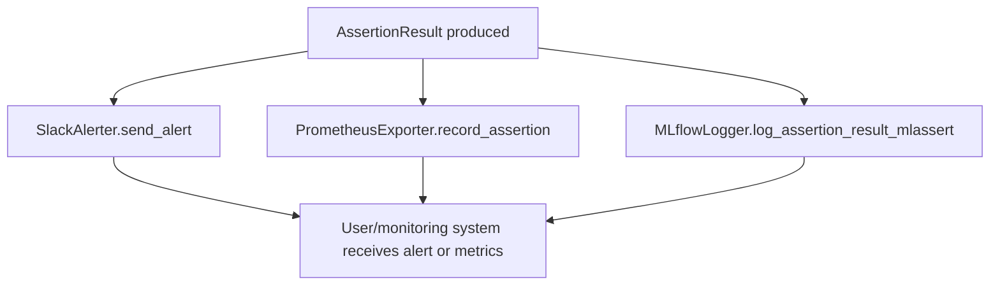

# Integrations

ml-assert provides integrations for alerting and monitoring assertion results in production ML workflows. The main integrations are:

- **SlackAlerter**: Send alerts to a Slack channel via webhook.
- **PrometheusExporter**: Expose assertion results as Prometheus metrics.
- **MLflowLogger**: Log assertion results to MLflow experiments.

---

## API Reference

(See below for each integration's API and usage.)

---

## Error Handling & Result Reporting

- All integrations accept an `AssertionResult` object for reporting.
- Integrations use the `success`, `message`, and `metadata` fields for alerting, logging, and monitoring.
- If an integration fails (e.g., network error), the CLI logs a warning but does not stop the workflow.
- Use the `metadata` field to enrich alerts and logs with additional context.

---

## Integration Workflow Diagram



---

## Advanced Usage: Combining Integrations

You can combine multiple integrations in a workflow for robust monitoring and alerting.

**Example:**
```python
from ml_assert.integrations.slack import SlackAlerter
from ml_assert.integrations.prometheus import PrometheusExporter
from ml_assert.integrations.mlflow import MLflowLogger
from ml_assert.core.base import AssertionResult
from datetime import datetime

# Set up integrations
slack = SlackAlerter(webhook_url="https://hooks.slack.com/services/your/webhook/url")
prom = PrometheusExporter(port=8000)
prom.start()
mlflow_logger = MLflowLogger(experiment_name="my-experiment")
mlflow_logger.start_run()

# Run an assertion and report
result = AssertionResult(success=False, message="Test failed", timestamp=datetime.now(), metadata={"step": "validation"})
slack.send_alert(result, title="ML Assertion Failure")
prom.record_assertion(result)
mlflow_logger.log_assertion_result_mlassert(result, step_name="validation_step")
mlflow_logger.end_run()
```

---

## SlackAlerter

Send alerts to a Slack channel when assertions fail.

**Class:** `ml_assert.integrations.slack.SlackAlerter`

```python
from ml_assert.integrations.slack import SlackAlerter
from ml_assert.core.base import AssertionResult
from datetime import datetime

alerter = SlackAlerter(webhook_url="https://hooks.slack.com/services/your/webhook/url")
result = AssertionResult(success=False, message="Test failure", timestamp=datetime.now(), metadata={})
alerter.send_alert(result, title="ML Assertion Failure")
```

- `webhook_url` (str): Your Slack webhook URL.
- `send_alert(result, title=None)`: Send an alert for an `AssertionResult`.

---

## PrometheusExporter

Expose assertion results as Prometheus metrics for monitoring.

**Class:** `ml_assert.integrations.prometheus.PrometheusExporter`

```python
from ml_assert.integrations.prometheus import PrometheusExporter
from ml_assert.core.base import AssertionResult
from datetime import datetime

exporter = PrometheusExporter(port=8000)
exporter.start()
result = AssertionResult(success=True, message="Test passed", timestamp=datetime.now(), metadata={})
exporter.record_assertion(result)
```

- `port` (int): Port to serve metrics (default: 8000).
- `start()`: Start the HTTP server for Prometheus scraping.
- `record_assertion(result)`: Record an `AssertionResult` as metrics.

---

## MLflowLogger

Log assertion results to MLflow for experiment tracking and auditing.

**Class:** `ml_assert.integrations.mlflow.MLflowLogger`

```python
from ml_assert.integrations.mlflow import MLflowLogger
from ml_assert.core.base import AssertionResult
from datetime import datetime

logger = MLflowLogger(experiment_name="my-experiment")
logger.start_run()
result = AssertionResult(success=True, message="Test passed", timestamp=datetime.now(), metadata={"step": "validation"})
logger.log_assertion_result_mlassert(result, step_name="validation_step")
logger.end_run()
```

- `experiment_name` (str): Name of the MLflow experiment.
- `run_name` (str, optional): Name for the MLflow run.
- `tracking_uri` (str, optional): MLflow tracking server URI.
- `start_run()`: Start a new MLflow run.
- `end_run(status="FINISHED")`: End the current run.
- `log_assertion_result_mlassert(result, step_name=None)`: Log an `AssertionResult` to MLflow.

---

## Example: YAML Configuration

You can enable integrations in your YAML config for the CLI runner:

```yaml
slack_webhook: "https://hooks.slack.com/services/your/webhook/url"
prometheus_port: 8000
steps:
  - type: model_performance
    y_true: "data/y_true.csv"
    y_pred: "data/y_pred.csv"
    assertions:
      accuracy: 0.8
      f1: 0.7
```

- Slack alerts will be sent for failed assertions.
- Prometheus metrics will be exposed on the specified port.
